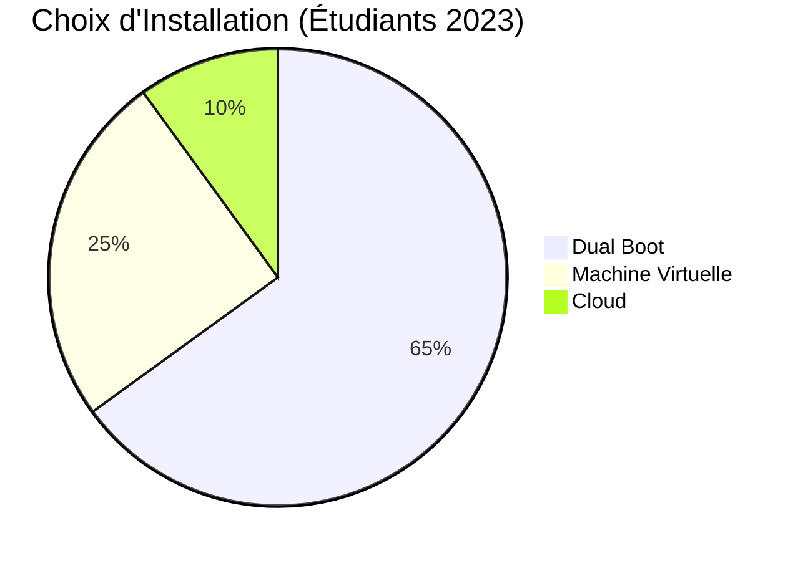

# 🛠️ Configuration de l'environnement

!!! tip "Recommandé"
    Utilisez Linux pour une compatibilité optimale

## Dual Boot vs VM

## Commandes Essentielles

# Mettre à jour les paquets

sudo apt update && sudo apt upgrade -y

# Installer Jupyter Lab

pip install jupyterlab
julia -e 'using Pkg; Pkg.add("IJulia")'

!!! warning "Attention"
Les machines virtuelles peuvent avoir des problèmes de performance avec Julia.