# 🔍 Comparatif Julia/Python

## Syntaxe de base

=== "Julia"
    ```julia title="Exemple Julia" linenums="1"
    # Fonction factorielle
    function factorielle(n)
        n < 2 ? 1 : n * factorielle(n-1)
    end

    # Typage explicite
    function add(a::Int, b::Int)::Int
        return a + b
    end

    # Broadcast
    x = [1, 2, 3]
    y = x .^ 2  # [1, 4, 9]
    ```

=== "Python"
    ```python title="Exemple Python" linenums="1"
    # Fonction factorielle
    def factorielle(n):
        return 1 if n < 2 else n * factorielle(n-1)

    # Typage (optionnel)
    from typing import Union
    def add(a: int, b: int) -> int:
        return a + b

    # List comprehension
    x = [1, 2, 3]
    y = [i**2 for i in x]  # [1, 4, 9]
    ```

## Lexique Julia

!!! note "Conventions de syntaxe"
    ```julia
    # Types
    struct Point
        x::Float64
        y::Float64
    end

    # Macros
    @time begin
        # Code à mesurer
    end

    # Chaînes multi-lignes
    s = \"\"\"
        Chaîne
        sur plusieurs
        lignes
    \"\"\"
    ```

## REPL et Console

```julia-repl title="Session REPL Julia"
julia> x = 5
5

julia> function carré(x)
           x^2
       end
carré (generic function with 1 method)

julia> carré(x)
25
```

## Diagrammes

```mermaid
graph LR
    A[Julia] --> B[Performant]
    A --> C[Typage fort]
    D[Python] --> E[Écosystème riche]
    D --> F[Facile à apprendre]
```

