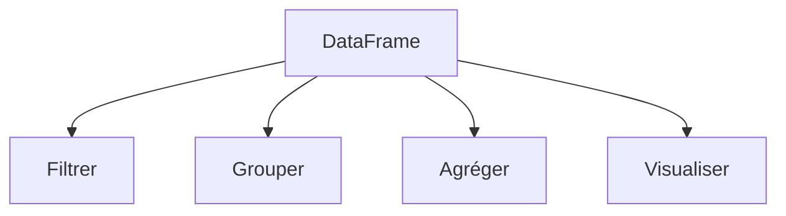

# 🐼 Pandas - Manipulation de Données

## Chargement des Données

```python title="load_data.py"
import pandas as pd
```

# Lire un CSV

df = pd.read_csv("titanic.csv")

# Afficher les 5 premières lignes

print(df.head())

