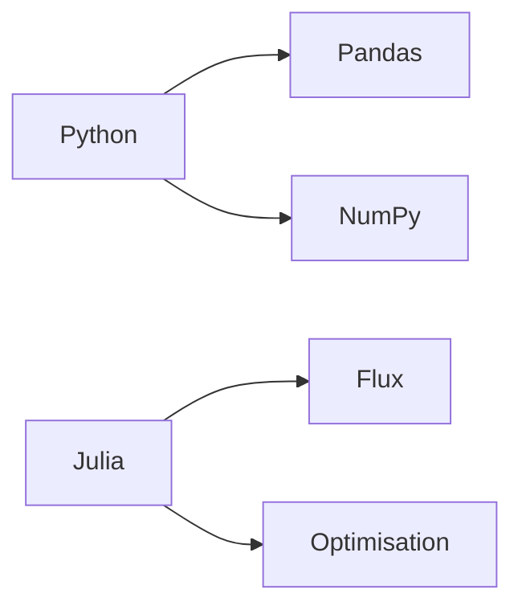
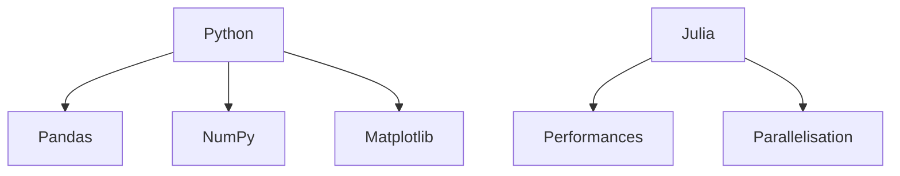

# 👋 Bienvenue dans le cours Outils Informatiques L3-SNIO

{ width=700 align=center }



## 📚 Objectifs du Cours

✅ Maîtriser les bases de Python 3 et Julia

✅ Savoir manipuler des données avec Pandas

✅ Créer des visualisations avec Matplotlib/Plots

✅ Automatiser des tâches avec Bash/Linux

## 🛠️ Configuration Requise

=== "Windows"
```shell
wsl --install -d Ubuntu sudo apt install python3 julia
```

=== "macOS"
```bash 
brew install python julia
```

=== "Linux"
```bash 
sudo apt update && sudo apt install python3 julia 
```


## 📚 Ressources

